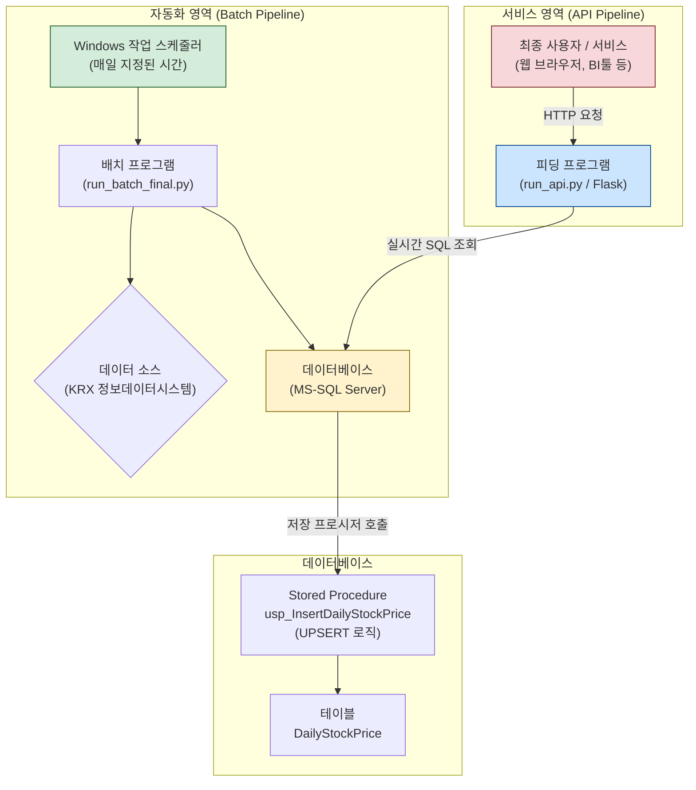

```mermaid
graph TD
    subgraph "자동화 영역 (Batch Pipeline)"
        A["Windows 작업 스케줄러 <br> (매일 지정된 시간)"] --> B["배치 프로그램 <br> (run_batch_final.py)"];
        B --> C{"데이터 소스 <br> (KRX 정보데이터시스템)"};
        B --> D["데이터베이스 <br> (MS-SQL Server)"];
    end

    subgraph "데이터베이스"
        D -- "저장 프로시저 호출" --> E["Stored Procedure <br> usp_InsertDailyStockPrice <br> (UPSERT 로직)"];
        E --> F["테이블 <br> DailyStockPrice"];
    end

    subgraph "서비스 영역 (API Pipeline)"
        G["최종 사용자 / 서비스 <br> (웹 브라우저, BI툴 등)"] -- "HTTP 요청" --> H["피딩 프로그램 <br> (run_api.py / Flask)"];
        H -- "실시간 SQL 조회" --> D;
    end

    style A fill:#d4edda,stroke:#155724
    style H fill:#cce5ff,stroke:#004085
    style G fill:#f8d7da,stroke:#721c24
    style D fill:#fff3cd,stroke:#856404
```
