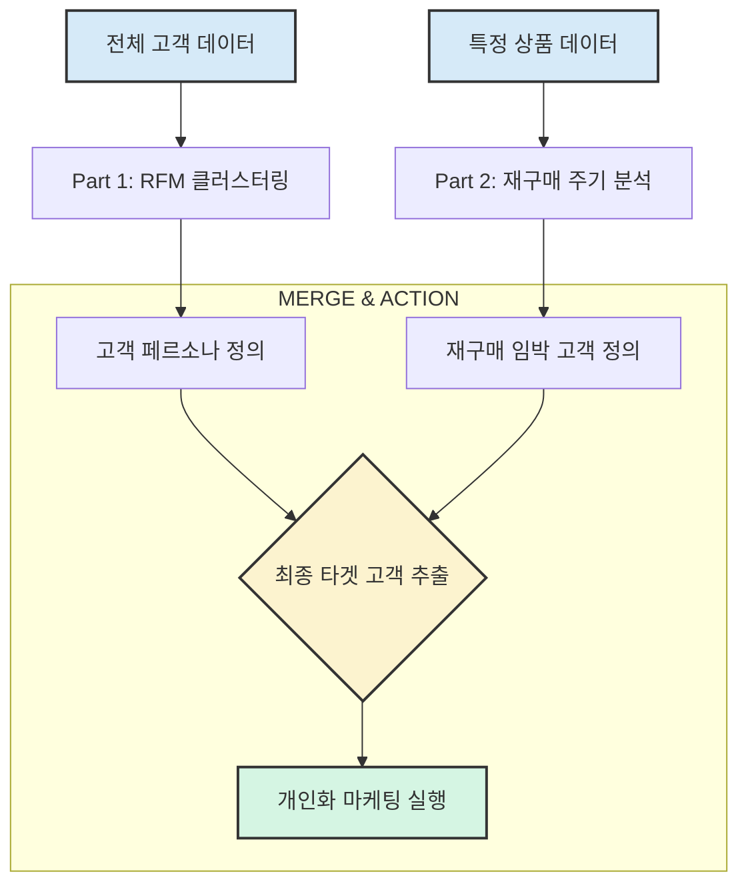

```mermaid
graph TD
    A[전체 고객 데이터] --> B[Part 1: RFM 클러스터링];
    B --> C[고객 페르소나 정의];

    D[특정 상품 데이터] --> E[Part 2: 재구매 주기 분석];
    E --> F[재구매 임박 고객 정의];

    subgraph MERGE & ACTION
        C --> G{최종 타겟 고객 추출};
        F --> G;
        G --> H[개인화 마케팅 실행];
    end

    style A fill:#D6EAF8,stroke:#333,stroke-width:2px
    style D fill:#D6EAF8,stroke:#333,stroke-width:2px
    style H fill:#D5F5E3,stroke:#333,stroke-width:2px
    style G fill:#FCF3CF,stroke:#333,stroke-width:2px
```
